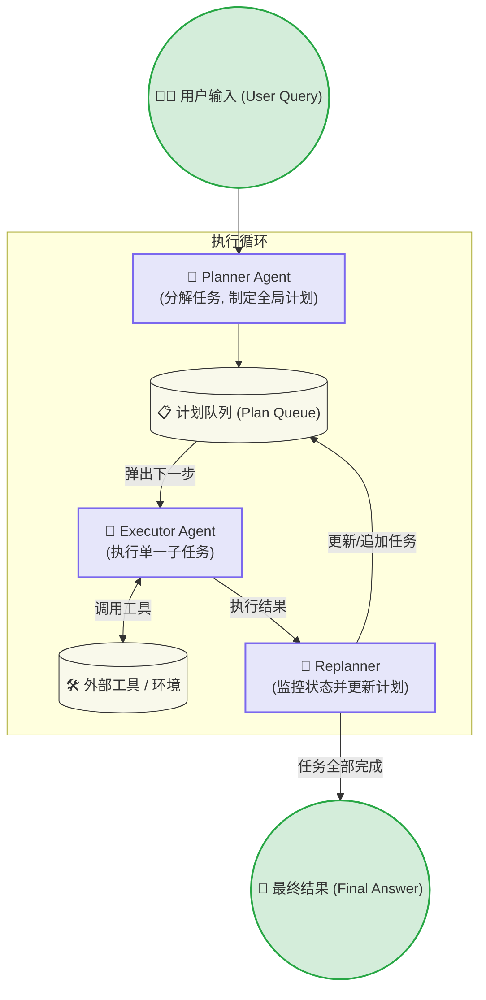
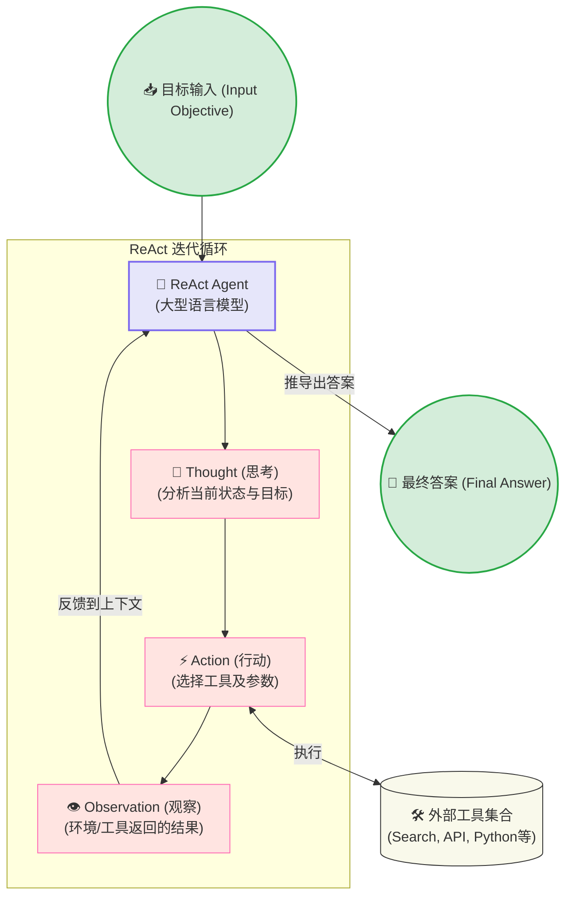

# 🧠 核心智能体架构范式 (Core Agent Architectures)

本文档阐述了前沿多智能体系统所采用的三大核心基础架构范式（Plan-and-Execute, ReAct, Reflection），包含其架构图、核心论文出处以及标准提示词模版。这些范式也是 Agentic-DataLab 复杂工作流的理论基石。

---

## 1. Plan-and-Execute (计划与执行架构)

**核心思想**: 将复杂的任务分解为可执行的多个子任务计划，然后按顺序依次执行。如果执行中遇到变化，会通过重新计划（Replanning）来调整后续步骤。此架构将"思考/规划"与"执行"分离，有效提升了长周期任务的成功率。

**代表论文**: 
- *Plan-and-Solve Prompting: Improving Zero-Shot Chain-of-Thought Reasoning by Large Language Models* (Wang et al., 2023)
- *HuggingGPT: Solving AI Tasks with ChatGPT and its Friends in Hugging Face* (Shen et al., 2023)

### 📊 架构图



### 💬 核心提示词 (Prompt Template)

**Planner Prompt**:
```text
You are an expert planner. For the given objective, come up with a simple step-by-step plan. 
This plan should involve individual tasks, that if executed correctly will yield the correct answer. 
Do not add any superfluous steps. The result of the final step should be the final answer. 
Make sure that each step has all the information needed - do not skip steps.

Objective: {user_objective}
Plan:
```

---

## 2. ReAct (Reasoning + Acting)

**核心思想**: 结合了推理（Reasoning）和行动（Acting）。模型在执行动作前先"大声思考"（Thought），然后选择合适的工具进行操作（Action），获取环境反馈（Observation）后，再次进入思考环节。这种交替模式极大地增强了模型的逻辑连贯性和工具使用能力。

**代表论文**: 
- *ReAct: Synergizing Reasoning and Acting in Language Models* (Yao et al., 2022)

### 📊 架构图



### 💬 核心提示词 (Prompt Template)

**ReAct System Prompt**:
```text
Answer the following questions as best you can. You have access to the following tools:
{tools}

Use the following format:
Question: the input question you must answer
Thought: you should always think about what to do
Action: the action to take, should be one of [{tool_names}]
Action Input: the input to the action
Observation: the result of the action
... (this Thought/Action/Action Input/Observation can repeat N times)
Thought: I now know the final answer
Final Answer: the final answer to the original input question

Begin!
Question: {input}
Thought:
```

---

## 3. Reflection (反思与自我纠错)

**核心思想**: 引入一种"自我批判"机制。生成器（Generator）首先产出初稿或初步代码，然后在环境中运行或由评价器评估。反思器（Critic/Reflector）根据执行报错或不理想的结果，生成详细的诊断和改进建议，并将这些反馈传回生成器进行迭代优化。

**代表论文**: 
- *Reflexion: Language Agents with Verbal Reinforcement Learning* (Shinn et al., 2023)

### 📊 架构图

```mermaid
graph TD
    Input(("📥 用户请求 (User Request)")) --> Generator
    
    subgraph Reflection Framework [反思迭代框架]
        direction TB
        Generator["✍️ Generator Agent<br/>(生成初始响应/代码)"]
        Env[("💻 环境/测试 (Environment)<br/>(执行代码或评估质量)")]
        Critic["🧐 Critic / Reflector Agent<br/>(分析错误并提供指导性反馈)"]
        
        Generator -->|输出初稿| Env
        Env -->|执行报错 / 测试失败| Critic
        Critic -->|建设性反馈 (Reflection)| Generator
    end
    
    Env -->|成功 / 验证通过| Output(("✅ 最终验证答案 (Validated Answer)"))
    
    classDef default fill:#f9f9eb,stroke:#333,stroke-width:1px;
    classDef agent fill:#e6e6fa,stroke:#7b68ee,stroke-width:2px;
    classDef io fill:#d4edda,stroke:#28a745,stroke-width:2px;
    
    class Generator,Critic agent;
    class Input,Output io;
```

### 💬 核心提示词 (Prompt Template)

**Critic / Reflector Prompt**:
```text
You are an expert reviewer and code critic. 
You are given a previous attempt at a task, the code/output generated, and the resulting execution error or test failure.
Your job is to carefully analyze the failure, explain exactly WHY the previous attempt failed, and provide actionable, specific feedback on how to fix it.
DO NOT write the code yourself, only provide the detailed reflection and instructions for the generator to fix the issue.

Previous Attempt: 
{draft}

Execution Output/Error: 
{error}

Provide your detailed reflection and advice for the next iteration:
```
