# 🚀 Agentic-DataLab: Multi-Agent Data Science Workflow Orchestrator


Agentic-DataLab is an **Enterprise-Grade, Multi-Agent AI system** designed to fully automate the Data Science and Machine Learning lifecycle. Built on top of LangGraph's state machine architecture and an asynchronous FastAPI backend, it orchestrates a swarm of specialized AI agents to handle everything from data ingestion and cleaning to feature engineering, model training (AutoML/H2O), and evaluation.

The frontend is a robust Vue 3 + Vite application providing real-time WebSocket communication, event timelines, and dynamic Plotly visualizations.

---

## 📸 Workspace Showcase

Agentic-DataLab features a dynamic, real-time Vue 3 interface to track multi-agent interactions, pipeline execution, and data artifacts.

<div align="center">
  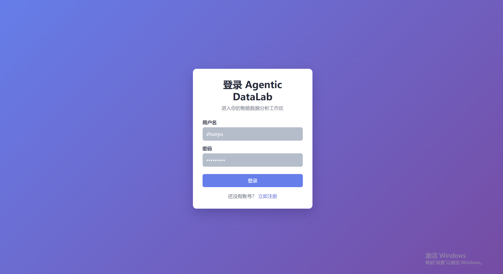
  <br/>
  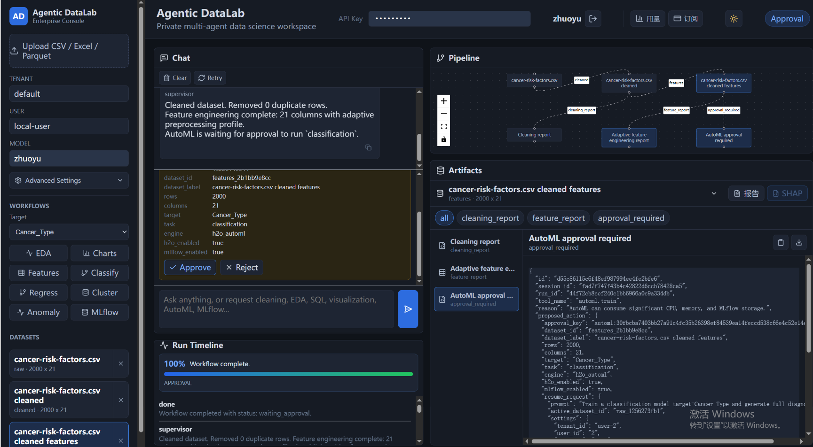
  <br/>
  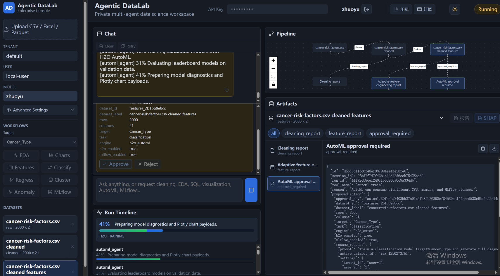
  <br/>
  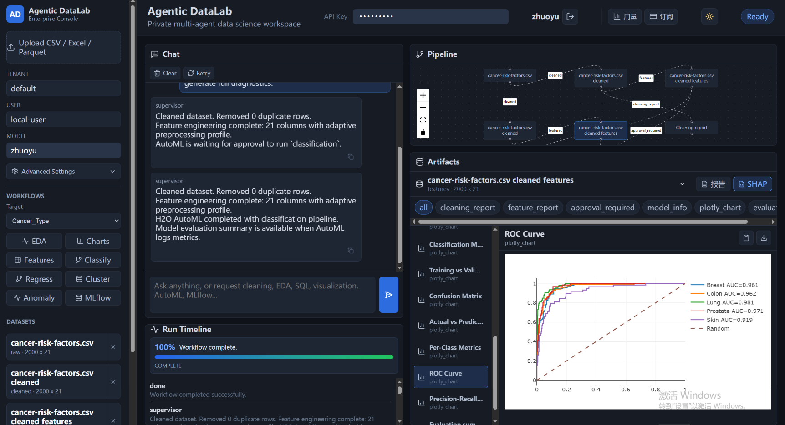
  <br/>
  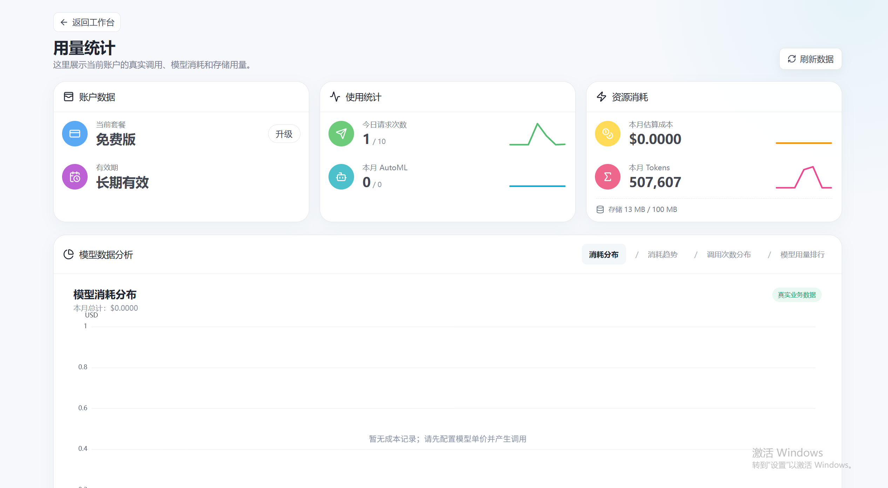
  <br/>
  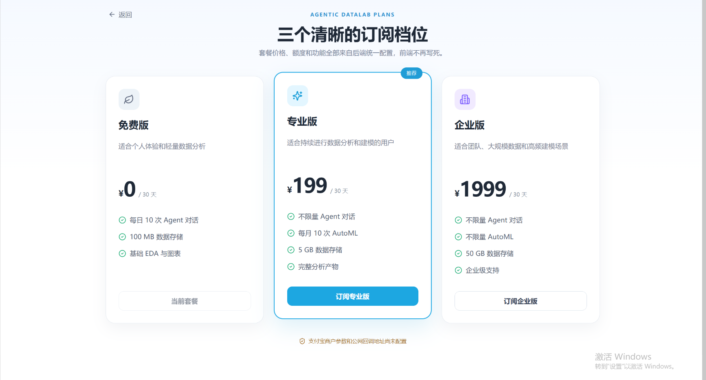
</div>

---

## 🏗️ System Architecture

Our system employs a strict separation of concerns, heavily utilizing the **Supervisor-Worker** multi-agent pattern with resilient memory checkpointing.

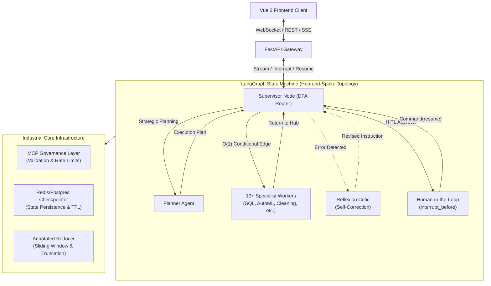

---

## 🔄 End-to-End Interaction Flow (前后端交互全链路)

To handle high-concurrency LLM streaming and complex state pauses, the system employs an asynchronous event-driven architecture separating the REST API from the Server-Sent Events (SSE) bus.

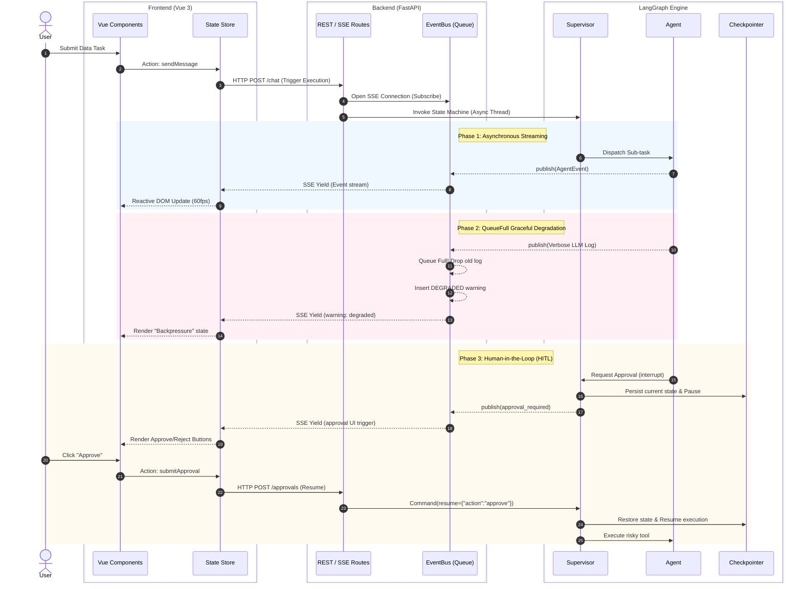

---

## 🧠 Core Agentic Paradigms (核心智能体架构)

Our engine is built upon three foundational multi-agent paradigms. These patterns ensure robust reasoning, resilient execution, and continuous self-improvement across the data science lifecycle.

### 1. Plan-and-Execute (计划与执行架构)

**Reference**: *Plan-and-Solve Prompting: Improving Zero-Shot Chain-of-Thought Reasoning by Large Language Models* (Wang et al., 2023)

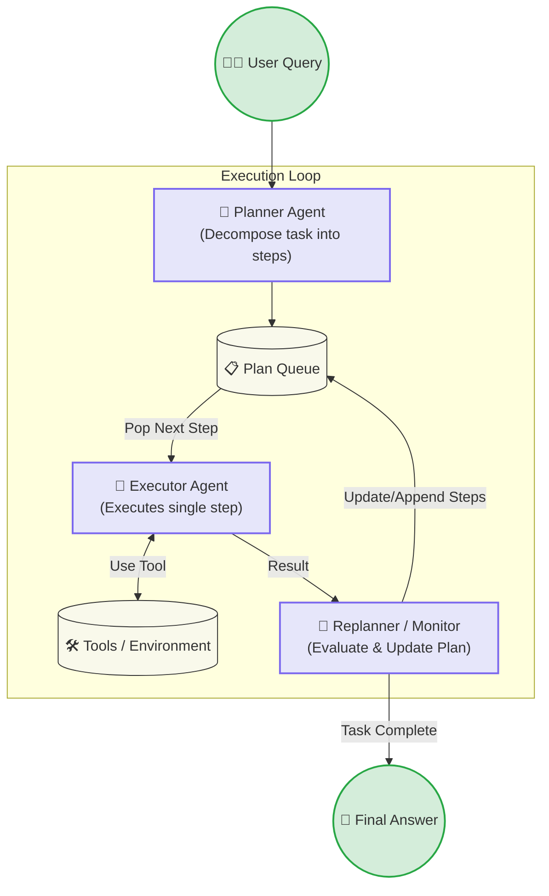

**Core Prompt**:
> "You are an elite Enterprise Data Science Architect and Macro Planner. Your sole job is to decompose the user's analytical goal into a sequence of executable steps. You are a STRATEGIST — you NEVER execute tools yourself. Each step must be assigned to exactly one specialist agent. Keep the plan minimal — do NOT add superfluous steps. Return ONLY strict JSON."

### 2. ReAct (Reasoning + Acting)

**Reference**: *ReAct: Synergizing Reasoning and Acting in Language Models* (Yao et al., 2022)

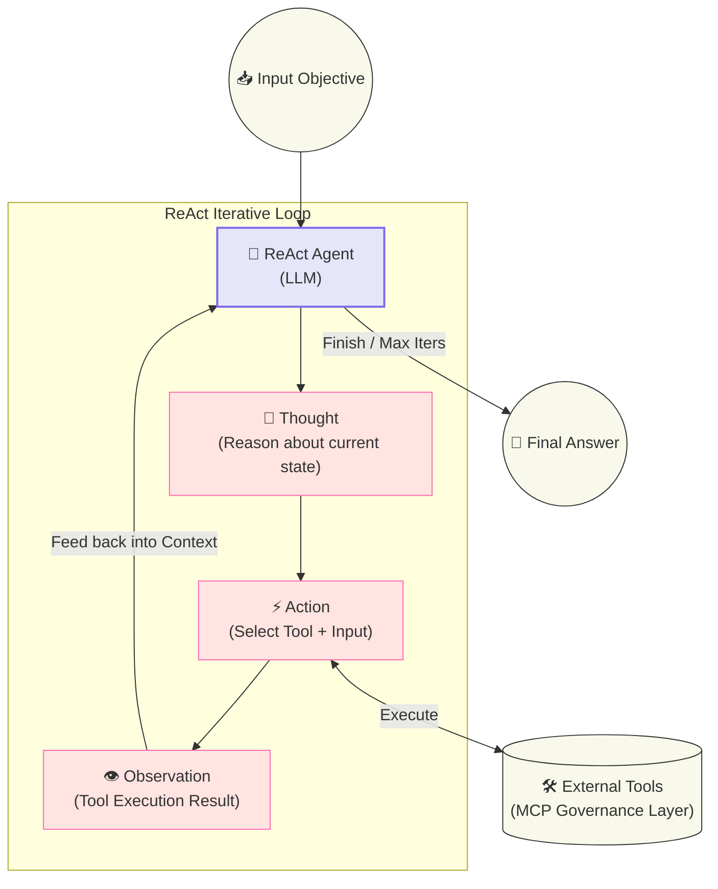

**Core Prompt**:
> "You are a ReAct-based AI assistant that solves complex tasks through iterative reasoning and tool usage. You MUST follow the structured Thought-Action-Observation loop strictly. ALWAYS start with a 'thought' that analyzes the current state. If a tool returns an error, reflect on WHY it failed and try a different approach. You have a maximum of 5 iterations. Use them wisely."

### 3. Reflection (反思与自我纠错)

**Reference**: *Reflexion: Language Agents with Verbal Reinforcement Learning* (Shinn et al., 2023)

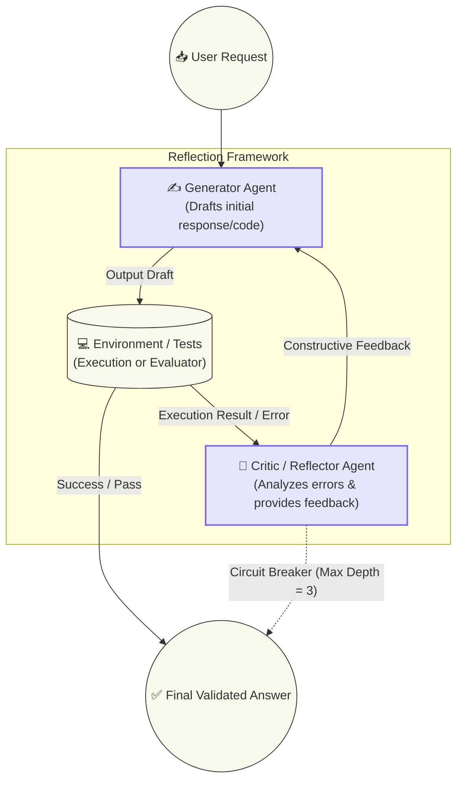

**Core Prompt**:
> "You are an expert reviewer, code critic, and debugging specialist. You are given a PREVIOUS ATTEMPT at a task that FAILED. Your job is to: 1. Carefully analyze the failure and explain exactly WHY it happened. 2. Identify the ROOT CAUSE. 3. Provide ACTIONABLE, SPECIFIC feedback on how to fix it. 4. Suggest a revised instruction that avoids the same mistake. Do NOT write the actual code yourself."

---

## 📂 Comprehensive Project Structure

The codebase is strictly modularized into isolated backend and frontend workspaces to ensure scalability and ease of deployment. 

> **Note to Reviewers**: This repository contains over **50+ specialized engine and UI components**. Please refer to the tree below for the exact layout of the microservices and agents.

```text
Agentic-DataLab/
├── backend/                             # Python / FastAPI / LangGraph Engine
│   ├── main.py                          # ASGI Entrypoint
│   ├── requirements.txt
│   ├── api/                             # REST & WebSocket Routes
│   │   └── routes/
│   ├── agents/                          # 🧠 Core Intelligence Swarm (17+ Modules)
│   │   ├── supervisor.py                # Graph Routing & Orchestration
│   │   ├── planner_agent.py             # Strategic Task Breakdown
│   │   ├── data_loader_agent.py         # Data Ingestion
│   │   ├── cleaning_agent.py            # Data Imputation & Cleaning
│   │   ├── eda_agent.py                 # Exploratory Data Analysis
│   │   ├── feature_agent.py             # Automated Feature Engineering
│   │   ├── sql_agent.py                 # Text-to-SQL Query Generation
│   │   ├── automl_agent.py              # AutoML Training Orchestration
│   │   ├── h2o_worker.py                # H2O.ai Integration Worker
│   │   ├── model_eval_agent.py          # Metrics & Model Validation
│   │   ├── visualization_agent.py       # Plotly JSON Generation
│   │   ├── reflexion_agent.py           # Self-Correction & Critic
│   │   ├── react_agent.py               # ReAct Pattern Baseline
│   │   ├── wrangling_agent.py           # Advanced Data Manipulation
│   │   └── base.py                      # Base Agent Interface
│   ├── core/                            # 🛡️ Defense & System Mechanics
│   │   ├── checkpoint.py                # Redis/Postgres State Persistence
│   │   ├── events.py                    # Pub/Sub Event Bus
│   │   ├── idempotency.py               # Idempotent Request Guard
│   │   ├── json_guard.py                # Strict JSON Output Validation
│   │   ├── llm.py                       # LLM Provider Gateway (DeepSeek/OpenAI)
│   │   ├── mcp.py                       # Model Context Protocol Gov
│   │   ├── security.py                  # JWT Auth & Security
│   │   ├── storage.py                   # Artifact S3/Local Storage
│   │   └── config.py                    # Environment Configuration
│   └── services/                        # Business Logic Layer
│       ├── pipeline.py
│       ├── jobs.py
│       ├── project_store.py
│       ├── sandbox.py                   # Secure Python Execution Env
│       └── workspace.py
│
├── frontend/                            # Vue 3 / Vite Client UI
│   ├── package.json
│   ├── vite.config.ts
│   └── src/
│       ├── main.ts                      # Application Bootstrap
│       ├── App.vue                      # Root Component
│       ├── api/
│       │   └── client.ts                # WebSocket & Axios Interceptors
│       ├── stores/
│       │   └── useWorkspace.ts          # Pinia State Management
│       ├── styles/
│       │   └── app.css                  # Tailwind / Global CSS
│       └── components/                  # 🎨 Modular UI Components
│           ├── ChatPanel.vue            # Interactive Agent Chat Interface
│           ├── PipelineGraph.vue        # Visual LangGraph Node Traversal
│           ├── EventTimeline.vue        # Real-time WebSocket Event Feed
│           ├── ArtifactTabs.vue         # File & Asset Viewer
│           ├── PlotlyChart.vue          # Dynamic Data Visualization
│           └── SidebarPanel.vue         # Project Navigation
│

```

---

## 🔒 Security & Secrets Management
This repository strictly adheres to GitOps security protocols. **No `.env` files, API keys, or JWT secrets are tracked in version control.** 
Please duplicate `backend/.env.example` to `backend/.env` and inject your proprietary LLM keys (OpenAI, DeepSeek) locally before running the backend.

## 🚀 Getting Started

### Backend Initialization
```bash
cd backend
python -m venv .venv
source .venv/bin/activate  # On Windows: .venv\Scripts\activate
pip install -r requirements.txt
# Configure .env file
uvicorn main:app --reload --port 8000
```

### Frontend Initialization
```bash
cd frontend
npm install
npm run dev
```

---
*Built for production-grade, asynchronous AI orchestration. Architecture designed for absolute determinism, hitl (human-in-the-loop) interruption, and dynamic scaling.*
